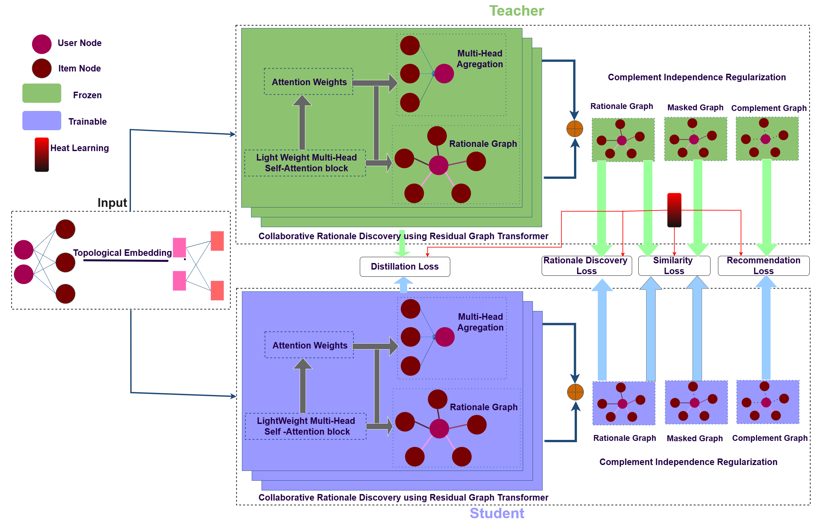

# Collaborative Rationale Discovery using Residual Graph Transformer

This repository contains the official implementation of **Collaborative Rationale Discovery using Residual Graph Transformer** for recommendation systems. It proposes a novel knowledge distillation framework (Teacher-Student) for precise and robust item recommendation.

## Architecture

The model uses a Teacher-Student framework designed to disentangle the user-item interaction graph into meaningful structural components:
- **Rationale Graph**: Represents the core patterns underlying user preferences.
- **Masked Graph**: Used for self-supervised rationale discovery.
- **Complement Graph**: Represents independent, auxiliary interaction signals.

To learn robust representations, the framework employs multiple loss functions:
- **Recommendation Loss**: BPR loss for predicting user-item interactions.
- **Distillation Loss**: Aligns the embeddings of the Student network with the Teacher network.
- **Rationale Discovery Loss**: Ensures the extracted rationale graph captures main predictive signals.
- **Similarity Loss & Complement Independence Regularization**: Promotes feature disentanglement between the rationale and complement graphs.



## Requirements

The codebase expects the following dependencies:
- Python == 3.8.13
- PyTorch == 1.9.1
- NumPy == 1.19.2
- SciPy == 1.9.0
- NetworkX == 2.8.6

```bash
pip install -r requirements.txt
```

## Datasets

The implementation supports the following datasets:
- **Yelp** (`sparse_yelp`)
- **iFashion** (`ifashion`)
- **Last.fm** (`lastfm`)
- **MIND** (`mind`)
- **Declic**  / **Declic Augmented**

*Note: Please ensure the datasets are unzipped and placed in the `GFormerAD/Datasets/` directory before running the code.*

## Usage

Navigate to the main directory and create the required output folders before executing the training script:

```bash
cd GFormerAD/GFormer-main
mkdir -p History Models Checkpoints BestCheckpoints
```

### Training Commands

Below are the commands to train the model, reflecting the hyperparameter settings used to generate the reported results in the paper.

#### Yelp
```bash
python Main.py --data yelp --reg 1e-4 --ssl_reg 1 --gcn 3 --ctra 1e-3 --b2 1 --pnn 1
```

#### iFashion
```bash
python Main.py --data ifashion --reg 1e-5 --ssl_reg 1 --gcn 2 --ctra 1e-3 --b2 1 --pnn 1
```

#### Last.fm
```bash
python Main.py --data lastfm --reg 1e-4 --ssl_reg 1 --gcn 2 --ctra 1e-3 --b2 1e-6 --pnn 2
```

## Advanced Training Features

This repository includes a comprehensive Checkpointing and Resume mechanism:
- **Automatic Checkpoint Saving**: Periodically saves the model's parameters and optimizer states in the `Checkpoints/` folder.
- **Best Model Tracking**: Automatically evaluates and stores the best-performing model (based on Recall/NDCG) in `BestCheckpoints/`.
- **Training Resume**: Use the `--resume` flag or specify a path via `--load_weights` to resume interrupted runs or initialize from a pre-trained model.

Example of resuming training:
```bash
python Main.py --data yelp --resume True
```

## Pre-Trained Weights

Pre-trained model weights could be sent upon request.

